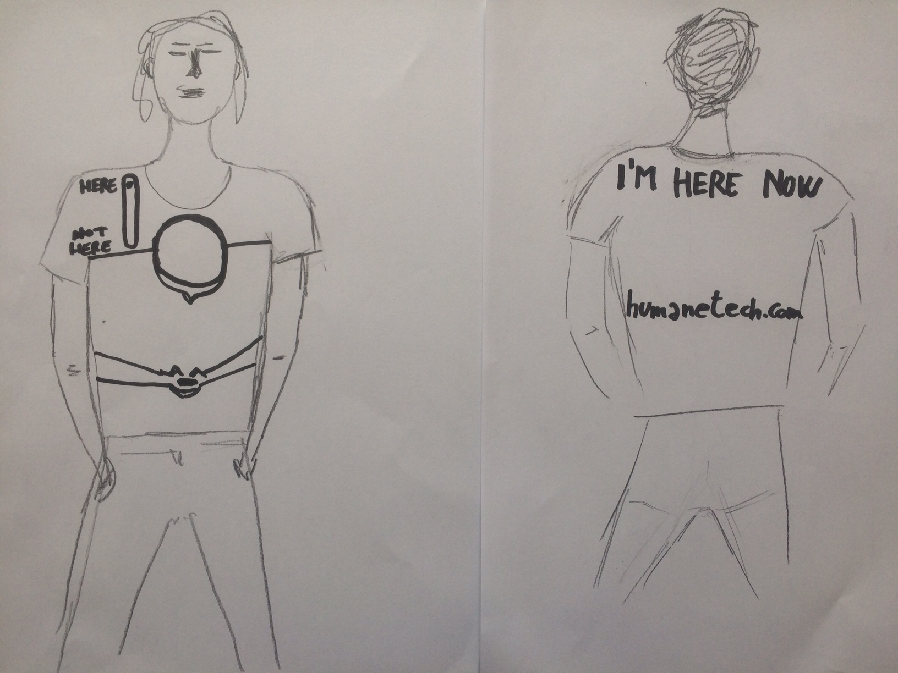

## I'm here now

The person wearing it will show the solution to the problem simply walking and being aware of the world and the people around him/her, 
in contrast to what is depicted down on the t-shirt. 

People around him/her will be catched by the optical effect of the same person both walking eyes up and sucked on the phone, 
and they can realize the augmented value of the person not being on their smartphone, but **being there in that moment**.

